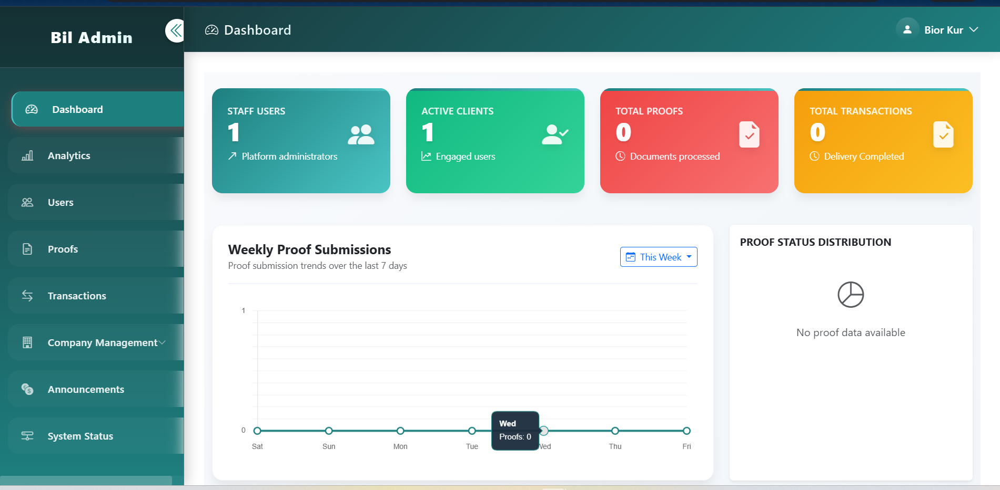
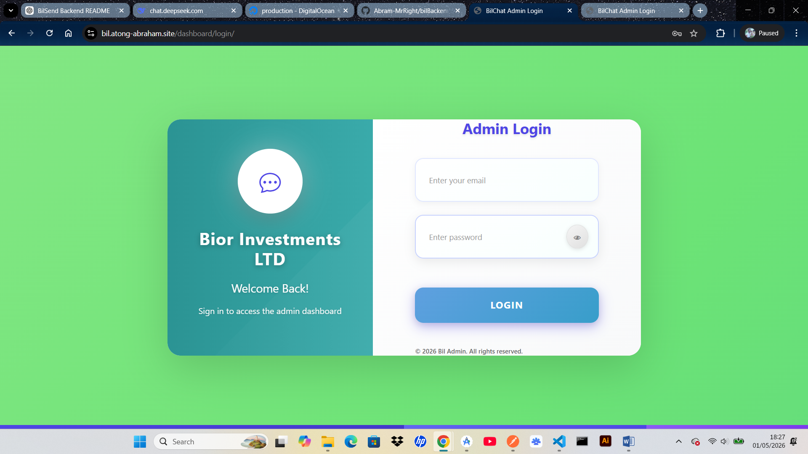

# 🚀 BilSend Backend (Django REST API)
<p align="center">  </p>

# 📌 Overview

BilSend is a mobile-based remittance management system designed to digitize and simplify money transfer operations between clients and a remittance company.

It allows clients to:

Upload proof of payment
Receive transaction receipts
Communicate via WhatsApp integration

Admins can:

Verify and update transactions in real time
Manage users and analytics
Control remittance workflows

The backend is built using Django REST Framework and powers both the Flutter client app and admin applications.

# 🎯 Purpose

This system was built to:
Digitize money remittance workflows
Improve communication between clients and staff
Enable real-time transaction tracking
Provide centralized admin control
Reduce manual verification and paperwork

# 📱 System Components
Client App (Flutter) – Upload payments, view receipts, track status
Admin App (Flutter) – Manage and verify transactions
Super Admin Panel (Django) – Analytics, users, transactions
Backend API (Django REST Framework) – Core system engine

```
🏗 System Architecture
┌─────────────────┐      ┌─────────────────┐      ┌─────────────────┐
│  Flutter Client │      │  Flutter Staff  │      │  Admin Web      │
│      App        │      │      App        │      │  Panel (Django) │
└────────┬────────┘      └────────┬────────┘      └────────┬────────┘
         │                        │                        │
         └────────────────────────┼────────────────────────┘
                                  │
                          ┌───────▼───────┐
                          │  Django REST  │
                          │    API        │
                          │  (bilSend)    │
                          └───────┬───────┘
                                  │
              ┌───────────────────┼───────────────────┐
              │                   │                   │
       ┌──────▼──────┐     ┌──────▼──────┐     ┌──────▼──────┐
       │ PostgreSQL  │     │    AWS S3   │     │ WhatsApp    │
       │  Database   │     │  (Files)    │     │  Business   │
       └─────────────┘     └─────────────┘     └─────────────┘
```
## ⚙️ Tech Stack
Backend: Django + Django REST Framework
Database: PostgreSQL / MySQL / SQLite
Auth: JWT / Token Authentication
Storage: Local / AWS S3
Messaging: WhatsApp Business API
Admin UI: Django Templates

# 📡 API Overview
```
🔐 Authentication
Endpoint	Method	Description
/auth/login/	POST	User login
/auth/register/	POST	Register user
/auth/logout/	GET	Logout
👤 Users
Endpoint	Method	Description
/users/	GET	List users
/users/{id}/	GET	Get user
/users/{id}/update/	PUT	Update user
/users/delete/	DELETE	Delete account
💰 Transactions
Endpoint	Method	Description
/transactions/	GET	List transactions
/transactions/{id}	GET	Transaction detail
/transactions/	POST	Create transaction
📎 Proofs
Endpoint	Method	Description
/proofs/	POST	Upload proof
/proof_list/	GET	View proofs
/proofs/{id}/status/	POST	Update status
```

## 🖼️ Screenshots

🧑‍💼 Login Page
<p align="center">  </p>
💰 User Dashboard
<p align="center">  </p>
📤 Uploaded Proof
<p align="center">  </p>

# ⚙️ Setup & Installation
## 1️⃣ Clone Project
```
git clone https://github.com/Abram-MrRight/bilBackend.git
```

cd bilBackend
## 2️⃣ Create Virtual Environment
```
python -m venv venv
```
```
source venv/bin/activate   # Windows: venv\Scripts\activate
```
## 3️⃣ Install Dependencies
```
pip install -r requirements.txt
```

## 4️⃣ Environment Setup

Create .env file:
```
DEBUG=True
ALLOWED_HOSTS=127.0.0.1,localhost

DATABASE_ENGINE=django.db.backends.sqlite3
DATABASE_NAME=db.sqlite3

EMAIL_HOST=smtp.gmail.com
EMAIL_PORT=587
EMAIL_USE_TLS=True
EMAIL_HOST_USER=
EMAIL_HOST_PASSWORD=
```

## 5️⃣ Run Server
```
python manage.py migrate
python manage.py runserver
```
# 🚀 Deployment

## 1️⃣ Install Server Dependencies
```
sudo apt update && sudo apt upgrade -y
sudo apt install python3-pip python3-venv nginx git -y
```
## 2️⃣ Clone Project on Server
```
cd /var/www/projects
git clone https://github.com/Abram-MrRight/bilBackend.git
cd bilBackend
```
## 3️⃣ Create Virtual Environment
```
python3 -m venv venv
source venv/bin/activate
pip install -r requirements.txt
```
## 4️⃣ Configure Environment Variables
```
nano .env
```
Set production values:
```
DEBUG=False
ALLOWED_HOSTS=bil.atong-abraham.site,165.232.180.102

DATABASE_ENGINE=django.db.backends.postgresql
```
## 5️⃣ Run Migrations & Collect Static
```
python manage.py migrate
python manage.py collectstatic --noinput
```
## 6️⃣ Gunicorn Service
```
sudo systemctl restart gunicorn_bilBackend
sudo systemctl status gunicorn_bilBackend
```
## 7️⃣ Nginx Restart
```
sudo systemctl restart nginx
```
## 📂 Project Structure
```
bilSend/
│
├── apps/
│   ├── users/
│   ├── transactions/
│   ├── proofs/
│
├── core/
├── config/
├── docs/
│   └── images/
├── manage.py
└── requirements.txt
```
## 📞 Support
```
📱 WhatsApp: 0782494005
📧 Email: atongkurabraham@gmail.com
📄 License

```
MIT License — free to use and modify.
