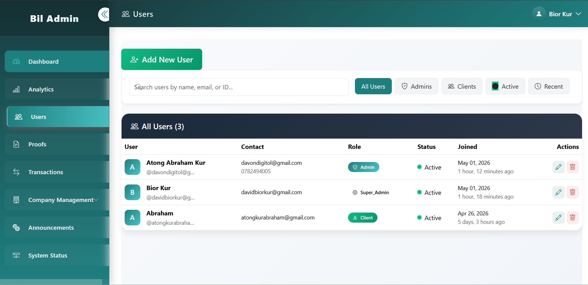
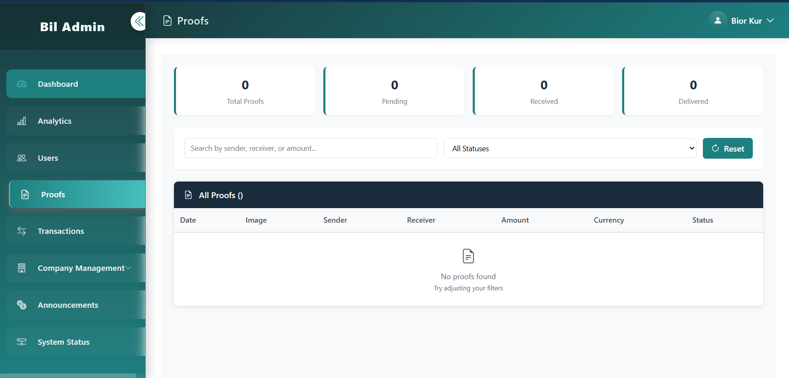

<h1 align="center">🚀BilSend Backend</h1>

  

<h1>Overview</h1>
BilSend is a mobile-based remittance management system designed to digitize and simplify money transfer operations between clients and a remittance company.

<h1>📱Client Features</h1>

Upload proof of payment
Receive transaction receipts
Communicate via WhatsApp integration

🧑‍💼 Admin Features
Verify and update transactions in real time
Manage users and analytics
Control remittance workflows

The backend is built using Django REST Framework and powers both Flutter apps and the admin system.

<h1>🎯Purpose</h1>

This system was built to:

Digitize money remittance workflows
Improve communication between clients and staff
Enable real-time transaction tracking
Provide centralized admin control
Reduce manual verification and paperwork

<h1>📱 System Components</h1>

📲 Client App (Flutter) – Upload payments, view receipts, track status
🧑‍💼 Admin App (Flutter) – Manage and verify transactions
🌐 Super Admin Panel (Django) – Analytics, users, transactions
🔗 Backend API (Django REST Framework) – Core system engine

<h1>⚙️Tech Stack</h1>

Layer	Technology
Backend	Django + Django REST Framework
Database	PostgreSQL / MySQL / SQLite
Auth	JWT / Token Authentication
Storage	Local / AWS S3
Messaging	WhatsApp Business API
Admin UI	Django Templates

<h1>📡API Overview</h1>

🔐 Authentication
Endpoint	Method	Description
/auth/login/	POST	User login
/auth/register/	POST	Register user
/auth/logout/	GET	Logout user

👤 Users
Endpoint	Method	Description
/users/	GET	List users
/users/{id}/	GET	Get user
/users/{id}/update/	PUT	Update user
/users/delete/	DELETE	Delete account

💰 Transactions
Endpoint	Method	Description
/transactions/	GET	List transactions
/transactions/{id}	GET	Transaction details
/transactions/	POST	Create transaction

📎 Proofs
Endpoint	Method	Description
/proofs/	POST	Upload proof
/proof_list/	GET	View proofs
/proofs/{id}/status/	POST	Update status

<h1>🖼️ Screenshots</h1>

<h1 align="center">📡API Overview</h1

  
 
<b>Login Page</b>

  
 
<b>User Dashboard</b>

  
 
<b>Uploaded Proofs</b>

<h1>⚙️Setup & Installation</h1>

1️⃣ Clone Project
git clone https://github.com/Abram-MrRight/bilBackend.git
cd bilBackend

2️⃣ Virtual Environment
python -m venv venv
source venv/bin/activate  # Windows: venv\Scripts\activate

3️⃣ Install Dependencies
pip install -r requirements.txt

4️⃣ Environment Variables
DEBUG=True
ALLOWED_HOSTS=127.0.0.1,localhost

DATABASE_ENGINE=django.db.backends.sqlite3
DATABASE_NAME=db.sqlite3

EMAIL_HOST=smtp.gmail.com
EMAIL_PORT=587
EMAIL_USE_TLS=True
EMAIL_HOST_USER=
EMAIL_HOST_PASSWORD=

5️⃣ Run Server
python manage.py migrate
python manage.py runserver

<h1>📞 Support</h1>

📱 WhatsApp: 0782494005
📧 Email: atongkurabraham@gmail.com

<h1>📄 License</h1>

MIT License — free to use and modify.
